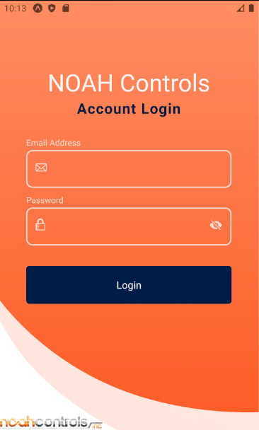
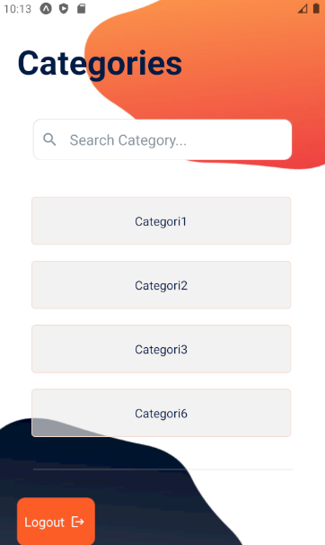
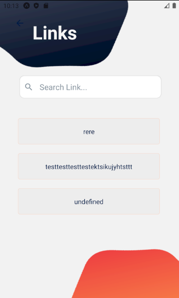

<<<<<<< HEAD
# NOAH Controls
An automation company that services major corporation and small manufacturing shop
=======
# Noah Controls 
A full frontend login system mobile application that has been connected to a hosted backend application. This was built for the following existing page (https://noahcontrols.com). 
The system contains the login page as the first screen, and then based on the logged-in user (credentials are stored in DB), a list of categories is displayed. Each category leads to a list of links.

## Built With
* [Expo](https://docs.expo.io/)
* [React Native](https://reactnative.dev/) 

For Back-End:
* [.NET Web APIs with C#](https://dotnet.microsoft.com/apps/aspnet/apis)

For Database:
* [SQL Server](https://www.microsoft.com/en-us/sql-server/sql-server-downloads)

## Screenshots

## Notes
(Expo Build Duration)
Build on android:  15-20 min 
Build on ios:  4-5 min
>>>>>>> e4ee4f3 (First commit-added login)
